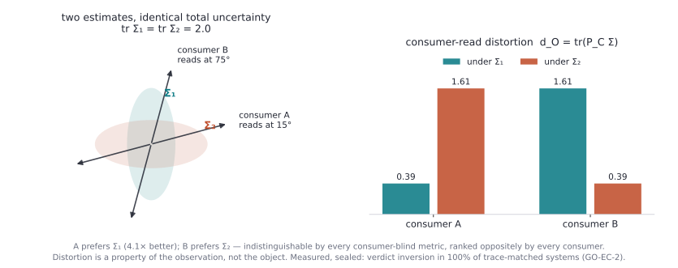

# Observation Theory

> **This is the front door.** One page, no evidence. Every claim of the
> program lives in a ledgered repository below and resolves to a
> preregistration row there — nothing is asserted here that a ledger cannot
> show. If you read only one linked page, read the
> [one-page manifesto](https://github.com/ahb-sjsu/geometric-observation/blob/master/OBSERVATION.md).

  <picture>
    <source media="(prefers-color-scheme: dark)" srcset="assets/flip-dark.svg">
    
  </picture>

The theory in one picture — every number computed by
<a href="assets/make_flip_figure.py"><code>assets/make_flip_figure.py</code></a>;
the measured version is ledger row
<a href="https://github.com/ahb-sjsu/geometric-observation/blob/master/claims/LEDGER.md">GO-EC-2</a>
(verdict inversion in 100% of trace-matched sensor-schedule systems).

**Thesis.** An observer is a triple **O = (C, G, B)**: a consumer, its output
metric, and a resolution budget. It induces a read metric
`P_C = JᵀGJ` — the geometry of what it can distinguish — and a quotient
`X/∼_C`, the world it can act on. **Geometry, distortion, and reliability are
properties of the observation — the consumer's read operator, budget, and
channel — not of the object observed.** The operative distortion is the
reconstruction error read through the consumer, `d_O = tr(P_C·Σ_δ)`;
classical least squares and Shannon rate–distortion are the corner
`P_C = I`, where the observer is assumed to read every direction equally.
The claim the theory adds: no real consumer does, and the correct
distortion, rate, capacity — and thermodynamic cost — are all
consumer-relative and computable.

**One object, three shadows.**

| Shadow | Question | Flagship results |
|---|---|---|
| **COST** | what observation charges | consumer-relative rate–distortion (achievability + converse); the two-observer region; the rate–work–distortion region (description rate vs. Landauer reset work); the complementarity tax and its exact region; the dynamic theory (staleness is access width, not delay); causal erasure; the adversarial observer |
| **VALUE** | what preserving the read buys | the consumer-relative flip: at matched bits, read-preserving codes beat reconstruction-optimal codes downstream *while reconstructing worse* — across ≥5 domains and ≥3 physics |
| **LEGIBILITY** | what the quotient reveals | angle carries geodesics where radius carries density; the recognizer names a manifold or certifies none; dimension emerges before shape |

**Method.** Registration precedes measurement. Sealed predictions with
ex-ante bars; misses published at equal prominence; fresh-context
adversarial verification; machine-checked algebra (Lean 4 / Mathlib); a
gap-free preregistration registry — the no-file-drawer accounting is itself
a published, git-verifiable artifact.

## The ecosystem — where everything lives

| Repository | What it holds |
|---|---|
| [**geometric-observation**](https://github.com/ahb-sjsu/geometric-observation) | ***Geometric Observation*** — the fourteenth book in the geometric series — and the program's **evidence ledger**: the preregistration registry (90+ sealed IDs, gap-free accounting), claims ledger, CI-rerun harnesses, Lean proofs, and Papers III–VIII sources. **Start here after this page.** |
| [**the-angular-observer**](https://github.com/ahb-sjsu/the-angular-observer) | Papers I & I.5 — the spectral/angular result (*Keep the Angle*) and the manifold recognizer |
| [**turboquant-pro**](https://github.com/ahb-sjsu/turboquant-pro) | Paper II — compression-as-observation: the engine, the (A2) probe, keys/values asymmetry |
| [**observation-theory-campaigns**](https://github.com/ahb-sjsu/observation-theory-campaigns) | The estimation-and-control campaigns (Paper VIII's operational faces, EC-1…EC-7) |
| [**readscope**](https://github.com/ahb-sjsu/readscope) | The five principles and their graduation crucibles |

## Start here

1. The [one-page manifesto](https://github.com/ahb-sjsu/geometric-observation/blob/master/OBSERVATION.md) — the whole theory on a page.
2. **Part A of the book** — the instruments, documented once and reused everywhere: [the blind probe](https://github.com/ahb-sjsu/geometric-observation/blob/master/chapters/ch10_the_blind_probe.md) · [the recognizer](https://github.com/ahb-sjsu/geometric-observation/blob/master/chapters/ch11_the_recognizer.md) · [the failure taxonomy and κ](https://github.com/ahb-sjsu/geometric-observation/blob/master/chapters/ch12_failure_taxonomy_and_kappa.md) · [registration-first method](https://github.com/ahb-sjsu/geometric-observation/blob/master/chapters/ch15_registration_first.md) · [the registry](https://github.com/ahb-sjsu/geometric-observation/blob/master/chapters/appendix_d_the_registry.md)
3. The [claims ledger](https://github.com/ahb-sjsu/geometric-observation/blob/master/claims/LEDGER.md) and the [no-file-drawer accounting](https://github.com/ahb-sjsu/geometric-observation/blob/master/claims/REGISTRY-ACCOUNTING.md) — what is claimed, at what evidence class, and why the sequence has no hidden holes.

**Names, once:** the theory is **Observation Theory** (this page). *Geometric
Observation* is the book documenting it. Paper numerals (I–VIII) are internal
shorthand; every public claim resolves to a ledger row. The public index name
is **DRI** (early drafts said "Bond Index"). Archived releases carry Zenodo
DOIs under the book repository.

*House rule: the program may not assert what the ledger cannot show.*
